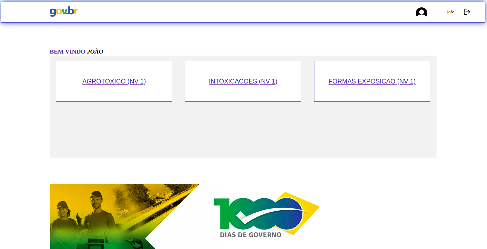
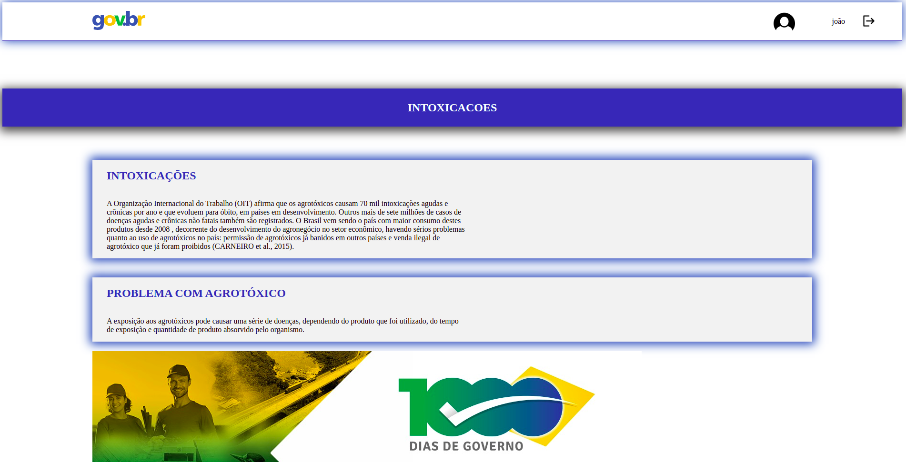

# Aplicação Web com validação biométrica
## Atividade prática Supervisionada

Essa aplicação foi elaborada para compor nota da disciplina do curso de Ciências da Computação - 6º Semestre, da matéria de PROCESSAMENTO DE IMAGEM E VISAO COMPUTACIONAL

### A aplicação

Este projeto tem por finalidade simular um portal que guarda informações diferentes dependendo do nivel de acesso do usuario, que podem ser acessados através de um sistema de login.

Para logar realizamos um sistema de validação biometrica utilizando o OpenCV.

### Tecnologias e bibliotecas utilizadas no Front-end

- React
- Axios
- react-router-dom
- styled-components
- OpenCV

### Tecnologias e bibliotecas utilizadas no Back-end

- NodeJS
- Express
- Mongodb
- Dotenv
- Jsonwebtoken
- Cors
- Nodemon

### Iniciando o desenvolvimento

Para iniciar o desenvolvimento, é necessário clonar o projeto do Github em um diretório de sua preferência.

Para instalar os pacotes do Back-end e iniciar em modo de desenvolvimento:

`cd backend/`

`npm i`

`npm start`

Para instalar os pacotes do Front-end e iniciar em modo de desenvolvimento:

`cd Front-End/client/`

`npm i`

`npm start`

### Principais telas da aplicação

- Login com CPF

- Validação biométrica

- Home

- Posts

### Desenvolvedores

- Gabriel Garcia Collo - | <a href="https://br.linkedin.com/in/gabrielcollo?trk=public_profile_browsemap">Linkedin</a> | <a href ="https://github.com/gabrielcollo">Github</a> | 
- Jonatas Venancio - | <a href="https://www.linkedin.com/in/jonatas-venancio-dev/">Linkedin</a> | <a href ="https://github.com/jovenan">Github</a> | 
- João Victor Inacio da Silva Oliveira - | <a href="https://br.linkedin.com/in/joao-inacio-24217a1a0?trk=public_profile_browsemap">Linkedin</a> | <a href ="https://github.com/joao-oliveira55">Github</a> |